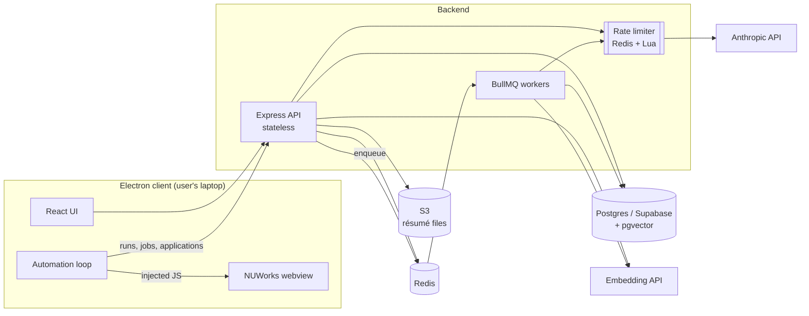
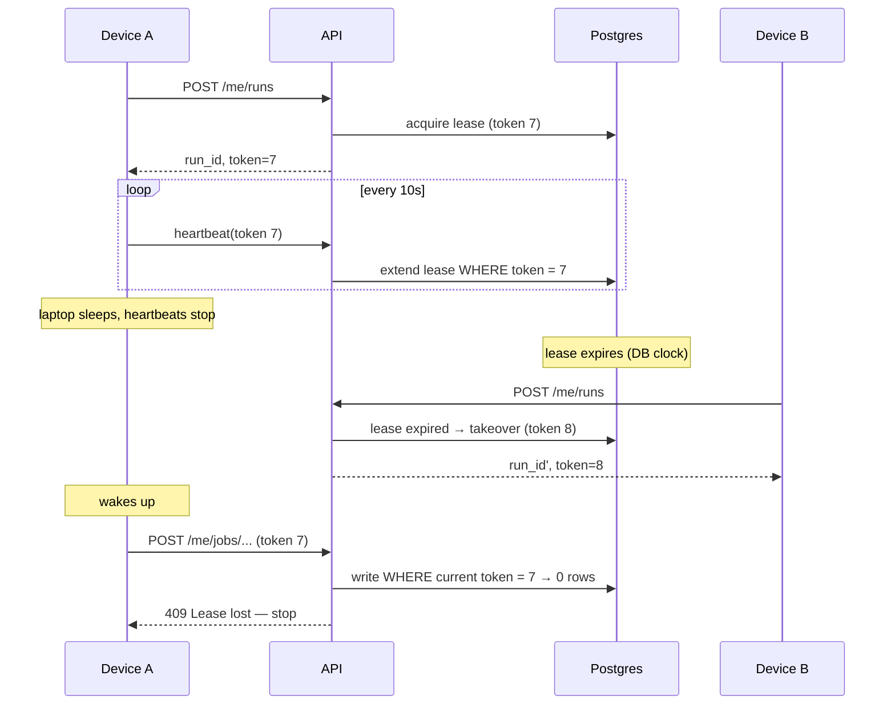
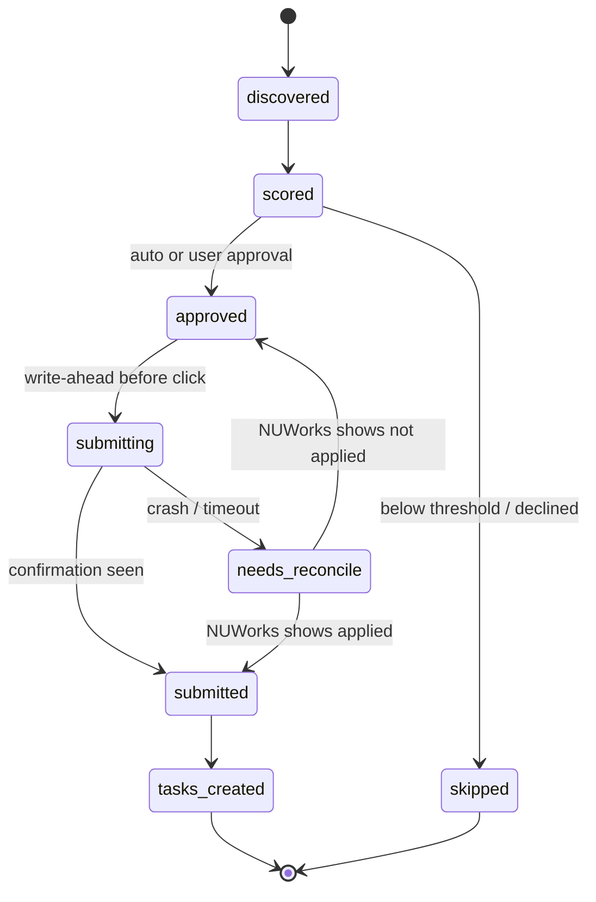
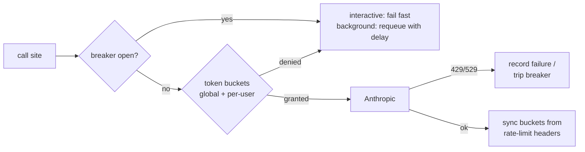
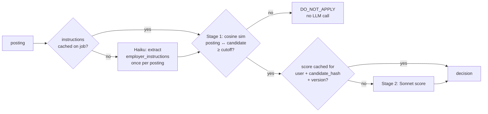

# ApplyNEU — High-Level Design

ApplyNEU is a desktop app that applies to co-op jobs on NUWorks for Northeastern students. An Electron
client drives NUWorks in an embedded webview; a backend scores each posting against the student's
résumé with Claude and records applications and follow-up tasks.

This document covers three subsystems built on top of that core:

1. **Run coordinator** — crash-safe, exactly-once-effect automation runs
2. **LLM rate limiter** — shared budget with priority lanes and a circuit breaker
3. **Matching funnel** — cheap retrieval before expensive LLM scoring

---

## 1. System overview



| Component | Responsibility | State |
|---|---|---|
| Electron client | Navigates NUWorks, scrapes postings, clicks submit, asks the user for approval | Ephemeral only; durable state lives on the server |
| API | Auth (Supabase JWT), run coordination, matching, applications, tasks | Stateless; scales horizontally |
| Workers | Résumé enrichment, background LLM work | Stateless; scale on queue depth |
| Postgres | Source of truth: users, jobs, matches, runs, applications | Durable |
| Redis | Queues, rate-limit buckets, circuit-breaker state, caches | Rebuildable; losing it costs money, never correctness |

**Guiding rule:** Postgres decides correctness, Redis decides throughput. Anything that must
not be wrong (who owns a run, whether a job was submitted) is decided inside a Postgres
transaction. Redis holds anything that only needs to be roughly right (budgets, caches).

---

## 2. Run coordinator

### Problem

An automation run used to live only in renderer memory (`seenJobs`, `currentJobApplicationId`).
A laptop sleeping, a crash, a dropped connection or a second device could lose progress, rescore jobs,
or apply to the same job twice. Submission is also an **external side effect** on NUWorks
that the backend cannot roll back.

### Goals

- At most one active run per user, even with multiple devices or zombie clients
- A crashed run resumes from where it stopped
- Every API mutation is idempotent under retry
- No duplicate NUWorks submissions, and an ambiguous submission is reconciled, never blindly retried

### Data model

```sql
active_runs (
  user_id          uuid PRIMARY KEY,
  run_id           uuid NOT NULL,
  device_id        text NOT NULL,
  fencing_token    bigint NOT NULL,       -- strictly increases on every takeover
  lease_expires_at timestamptz NOT NULL
)

runs (run_id PK, user_id, device_id, started_at, ended_at, status)   -- history

job_progress (
  user_id, job_id, step, run_id, fencing_token, updated_at,
  PRIMARY KEY (user_id, job_id)
)

idempotency_keys (
  user_id, key, request_hash, response jsonb, created_at,
  PRIMARY KEY (user_id, key)
)
```

### Lease and fencing



- **Acquire** is one statement: `INSERT … ON CONFLICT (user_id) DO UPDATE … SET fencing_token =
  fencing_token + 1 … WHERE lease_expires_at < now()`. No row returned means someone else holds it.
- **Fencing is checked inside the same transaction as the write.** Every mutating request
  carries `X-Run-Id` and `X-Fencing-Token`; the write only commits if the token is still current.
  A Redis lock can't give this guarantee, because the lock check and the Postgres write can't be atomic
  across two systems. That is why the lease lives in Postgres.
- **Expiry uses the database clock**, so client clock skew doesn't matter.
- **Explicit takeover:** the user can choose "run here instead", which bumps the token. The old
  device's next write gets a 409 and its run stops cleanly.

### Per-job state machine



- Legal transitions live in a table and are enforced by a trigger, so an illegal move fails
  at the database instead of corrupting state.
- **Write-ahead intent:** the client records `submitting` *before* clicking submit on NUWorks.
  On resume, a job left in `submitting` has an unknown outcome. The bot checks NUWorks to see whether
  it shows as applied, then moves the job forward or back accordingly. This turns an
  at-least-once external action into an effectively exactly-once one.
- **Resume:** `GET /me/runs/:id/progress` returns every non-terminal job, so the bot skips
  completed jobs and continues from the last step of unfinished ones. `seenJobs` becomes server state.

### Idempotency

Mutations carry `Idempotency-Key: {run_id}:{job_id}:{action}`. The first request stores its
response; a retry with the same key and request hash replays it. The same key with a *different*
hash is rejected with 422. This covers the most dangerous case: **the server commits, then the response is lost
in transit, and the client retries.**

### Verification: fault-injection harness

A Node simulator plays the client against the real API and a throwaway Postgres
(`docker compose --profile test`). Over N randomized runs it injects:

| Fault | Where |
|---|---|
| Process kill | Random point in the per-job state machine |
| Response dropped after commit | Every mutating endpoint |
| Client paused beyond lease TTL | Mid-run, then resumed |
| Two devices concurrently | Same user, racing acquire and takeover |

**Invariants checked after every run:**
- No job is submitted more than once
- Every discovered job ends in a terminal state
- No write is accepted with a stale fencing token
- `fencing_token` strictly increases per user

---

## 3. LLM rate limiter

### Problem

All Anthropic calls (scoring, task extraction, résumé enrichment) share one org-level limit.
Today each call site retries on its own (`withRetry`: 500/1000/2000ms). Under a 429, every
worker backs off and retries at the same moment. Background work also competes equally with a bot
that is waiting on a decision.

### Design

All model calls go through one client module (`llm/client.ts`) that runs three checks in order:



**Token buckets (Redis, atomic Lua):**
- Two buckets are checked in one script: global (the org's requests/min and input tokens/min) and per-user
  (for fairness, so one heavy user can't drain the shared budget).
- Both are debited or neither is. The script returns `{granted, retry_after_ms}`.
- Input tokens are estimated before the call. After the call, the real `usage` and the
  `anthropic-ratelimit-*-remaining` headers correct the bucket.

**Priority lanes via reserved capacity:**
- `interactive` (the bot is waiting) can use the full bucket.
- `background` (enrichment, pre-scoring) is only granted while the bucket is above a reserve
  (for example 30%), so headroom always remains for interactive work.
- This is implemented in the same Lua script as a lane argument. That is simpler and more atomic than
  two separate queues.

**Circuit breaker (shared across instances in Redis):**
- `closed → open` after K 429/529 responses in a window. The open TTL comes from `retry-after`.
- `half-open`: a single probe request, elected with `SET NX`. Success closes the breaker; failure re-opens it.
- While the breaker is open, background jobs are re-enqueued with **jittered** exponential backoff
  (`base · 2^n · rand(0.5, 1.5)`), so workers don't all retry in sync.

### Failure mode

If Redis is down, the limiter **fails open** to a conservative local per-process limit. The SDK's
own retry stays as a last line of defense. Losing Redis degrades throughput, never correctness.

---

## 4. Matching funnel

### Problem

Every unseen posting costs one Sonnet call while the bot waits. Most postings shown to a
student are obviously outside their field.

### Design



**Two cache layers:**
- **Posting level:** `employer_instructions` depend only on the posting. They are extracted once by
  Haiku and stored on `jobs`, then shared by every user. A per-posting lock (`pg_try_advisory_xact_lock` on the
  job id) makes sure two users hitting a new posting at the same moment trigger only one extraction.
- **User level:** `job_matches` is keyed by `(user_id, job_id, candidate_hash, scoring_version)`.
  It already exists. Removing extraction from the scoring prompt shrinks every Sonnet call.

**Stage 1, recall:**
- `jobs.embedding` and a candidate embedding (keyed by `candidate_hash`, so it is recomputed only when
  the résumé or interests change) are stored with pgvector and an HNSW index.
- Anthropic doesn't offer embeddings, so Stage 1 uses a separate embedding provider (e.g. Voyage).
- **The cutoff is tuned for recall, not precision.** It is set at the similarity that keeps ~99% of
  postings Sonnet would score above the user's lowest threshold, using a labeled sample. Dropping a
  good job costs far more than one extra Sonnet call.
- **Guardrail:** a small random fraction of below-cutoff jobs still goes to Sonnet. This measures
  Stage 1's false-negative rate in production.

**Deferred:** background pre-scoring of new postings with the Message Batches API.

---

## 5. Deployment

| Piece | How it runs |
|---|---|
| API | Docker image, stateless; more replicas behind a load balancer |
| Worker | Same image, different entrypoint; replicas scale on queue depth |
| Postgres | Supabase (managed), migrations applied expand → contract |
| Redis | Managed Redis in prod, `redis:8-alpine` locally |
| Desktop client | Electron build distributed to users |
| Local stack | `docker compose up` (API + worker + Redis); integration DB via `--profile test` |

**Operational details:**
- **Graceful shutdown:** on SIGTERM, workers stop taking jobs and finish in-flight ones. Interrupted
  jobs are retried, which is safe because every handler is idempotent.
- **Zero-downtime schema changes:** add a column or table → deploy code that writes both shapes →
  backfill → deploy code that reads the new shape → drop the old shape.
- **Client/server version skew:** desktop clients can't be force-updated. The API accepts requests
  without fencing headers for one release behind a minimum-client-version check, then requires them.

---

## 6. Metrics

| Metric | Source |
|---|---|
| Duplicate submissions under fault injection | Harness invariant (target: 0) |
| Runs resumed after crash | `runs` / `job_progress` |
| Model calls avoided by Stage 1 | Funnel decision log |
| Posting / user cache hit rate | `jobMatch` logs |
| p95 decision latency (cached vs. cold) | API timing |
| 429s reaching call sites | Rate limiter counters |
